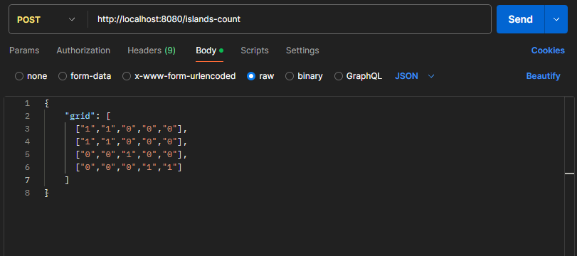
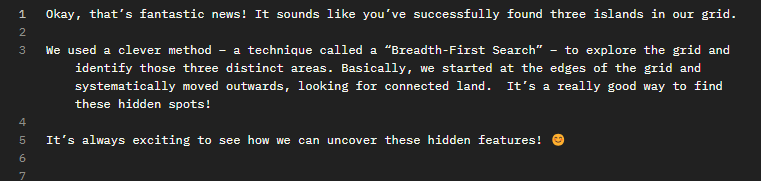

# 🌍 Island Counter with Helidon + Gemma 3 + BFS + AI Explanation

This project is a **Helidon-based REST API** that processes a 2D map grid (with `1`s as land and `0`s as water), calculates the number of **islands** using the **Breadth-First Search (BFS)** algorithm, and responds with a **human-friendly explanation generated by a Language Model (LLM)** such as [Ollama](https://ollama.com/) or OpenAI.

It's designed for performance, simplicity, and clean architecture — showing how you can build intelligent microservices with Java, Helidon, and GenAI.

---

## ✨ What It Does

- Accepts a grid of `1`s and `0`s via a `POST /islands-count` endpoint
- Uses a **BFS algorithm** to count the number of distinct islands
- Sends the result to an LLM (via LangChain4j) to generate a **natural language explanation**
- LLM output is streamed back to the client in a friendly, easy-to-understand format
- Supports **local models (Ollama)** or **cloud-based OpenAI** as fallback

---

## 🛠️ Technologies Used

- ☕ Java 24
- ⚙️ Helidon SE 4.2
- 🤖 LangChain4j
- 📦 Ollama (with `gemma3:1b`)
- 🧠 OpenAI (optional)
  
---

## 🚀 How to Run

### 1. 🧱 Clone the project

```bash
git clone https://github.com/seu-usuario/helidon-gemma3-bfs.git
cd helidon-gemma3-bfs
```
### 2. 🧠 Install Ollama (optional for local inference)

Follow the installation guide from the official site:
📎 [Ollama](https://ollama.com/)

```bash
ollama serve
ollama run gemma3:1b
```

### 3. ⚙️ Configure the LLM connection

Follow the installation guide from the official site:
📎 [Ollama](https://ollama.com/)

```yaml
langchain4j:
  ollama:
    chat-model:
      enabled: true
      api-key: "<your-api-key>"
      base-url: http://localhost:11434
      model-name: gemma:1.1b
      temperature: 0.7
      timeout: PT90S
      streaming: true
```

### 4. 🔐 [Optional] Use OpenAI instead of Ollama

If you prefer to use OpenAI's GPT models, update the **application.yaml** like this

```yaml
  open-ai: 
    chat-model:
      enabled: true
      api-key: "demo"
      model-name: "gpt-4o-mini"
```

### 5. ▶️ Run the application

```bash
  mvn clean install
  java -jar target/helidon-gemma3-bfs.jar
```




The server will be available at:

```bash
http://localhost:8080
```

```bash
curl -X POST http://localhost:8080/islands-count \
  -H "Content-Type: application/json" \
  -d '{
    "grid": [
      ["1","1","0","0","0"],
      ["1","1","0","0","0"],
      ["0","0","1","0","0"],
      ["0","0","0","1","1"]
    ]
  }'
```

### 5. ▶️ Response Example
```bash
"Three islands were found on the map, calculated using the BFS algorithm. Each one represents a separate piece of land surrounded by water."
```



## ✅ Why This Matters
### This project is an example of:

Real-world Java + AI integration

How to build smart, explainable microservices

Applying classic algorithms (BFS) + LLMs for user-friendly output

Using open source and GenAI to solve problems in production-ready apps

## 🧠 Extra Ideas
🔀 Switch from BFS to DFS with a config flag

📈 Add metrics to track performance

🌐 Translate response based on lang input

🧩 Add front-end to visualize the grid and AI response


